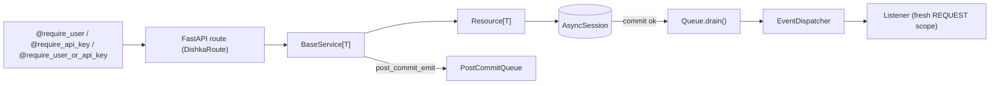

# Broker API Development

Canonical reference: `services/api/app/modules/products/` (fully implemented CRUD + events + tests).

## Architecture overview



The session provider in `app/lib/providers.py` commits, then drains `PostCommitQueue` (which fires events), or discards on rollback.

---

## 1. Module skeleton

For a new domain `foo`, create this tree under `services/api/app/modules/foo/`:

```
foo/
├── __init__.py               # package marker (avoid importing FooModule here)
├── module.py                 # AppModule subclass
├── provider.py               # Dishka Provider
├── events.py                 # domain event classes
├── listener.py               # register_listeners(dispatcher)
├── models/
│   ├── __init__.py           # exports MODULE_MODELS, Foo
│   └── foo.py                # SQLModel table
├── repositories/
│   ├── __init__.py           # exports FooRepository
│   └── foo_repository.py     # Resource[Foo]
├── services/
│   ├── __init__.py           # exports FooService
│   └── foo_service.py        # BaseService[Foo]
└── routes/
    ├── __init__.py           # assembles router
    └── foo.py                # endpoint functions
```

Then register in `services/api/app/modules/__init__.py`:

- Keep each domain package’s `__init__.py` **free of eager imports** (e.g. do not import `FooModule` from `app/modules/foo/__init__.py`). Import concrete modules from `app.modules.foo.module` in `get_app_modules()` only. This avoids import cycles with `app.lib.security`.
- Routes are normally protected with `@require_user`, `@require_api_key`, or `@require_user_or_api_key` from `app.lib.security` (see §9). Tenancy glue (`UserOrganization`, `ApiKey`) belongs in `app/modules/organization/`.

```python
def get_app_modules() -> tuple[AppModule, ...]:
    return (
        ProductsModule(),
        UserModule(),
        OrganizationModule(),
        FooModule(),          # add here
    )
```

---

## 2. AppModule contract

Every module implements `app/lib/app_module.py`:

```python
class FooModule(AppModule):
    @property
    def prefix(self) -> str:
        return "/foos"

    def get_router(self) -> APIRouter:
        return domain_router              # from routes/__init__.py

    def get_listener_registrar(self) -> Callable[[EventDispatcher], None]:
        return register_listeners         # from listener.py

    def get_models(self) -> tuple[type[SQLModel], ...]:
        return MODULE_MODELS              # from models/__init__.py

    def get_provider(self) -> Provider:
        return FooProvider()              # from provider.py
```

`register_modules` (called at startup) mounts the router and wires listeners for every module automatically.

---

## 3. Models (SQLModel)

```python
# models/foo.py
from datetime import datetime
from typing import ClassVar
from uuid import UUID, uuid4

from sqlmodel import Field, SQLModel

from app.lib.utils import utc_now


class Foo(SQLModel, table=True):
    IMMUTABLE_FIELDS: ClassVar[frozenset[str]] = frozenset({"id", "created_at"})
    id: UUID = Field(default_factory=uuid4, primary_key=True)
    name: str = Field(max_length=255)
    created_at: datetime = Field(default_factory=utc_now)
```

**Membership (composite PK)** — lives in the `organization` module; FK to `user` and `organization`:

```python
class UserOrganization(SQLModel, table=True):
    user_id: UUID = Field(foreign_key="user.id", primary_key=True)
    organization_id: UUID = Field(foreign_key="organization.id", primary_key=True)
    joined_at: datetime = Field(default_factory=utc_now)
```

**Organization API key** (hashed secret + lookup prefix; raw key shown once at creation):

```python
class ApiKey(SQLModel, table=True):
    IMMUTABLE_FIELDS: ClassVar[frozenset[str]] = frozenset(
        {"id", "organization_id", "prefix", "secret_hash", "created_at"}
    )
    id: UUID = Field(default_factory=uuid4, primary_key=True)
    organization_id: UUID = Field(foreign_key="organization.id", index=True)
    name: str = Field(max_length=255)
    prefix: str = Field(max_length=12, unique=True, index=True)
    secret_hash: str = Field(max_length=64)
    last_used_at: datetime | None = Field(default=None)
    created_at: datetime = Field(default_factory=utc_now)
    revoked_at: datetime | None = Field(default=None)
```

- `utc_now` returns naive UTC — keep all timestamps consistent.
- Declare `IMMUTABLE_FIELDS` when the resource exposes PATCH; omit it for write-once resources.
- Export from `models/__init__.py`:

```python
MODULE_MODELS: tuple[type[SQLModel], ...] = (Foo,)
__all__ = ["MODULE_MODELS", "Foo"]
```

---

## 4. Repository

Subclass `Resource[Model]` from `app/lib/resource.py`. The model class is inferred from the generic parameter; the body is `pass` unless custom queries are needed.

```python
# repositories/foo_repository.py
from app.lib.resource import Resource
from app.modules.foo.models import Foo

class FooRepository(Resource[Foo]):
    pass
```

Add custom queries (extra `SELECT` statements, filters, joins) here — **not** in the service.

Built-in methods: `list_all`, `get_by_id`, `create`, `update`, `delete`.

---

## 5. Service

Subclass `BaseService[Model]` from `app/lib/base_service.py`. Inherits full CRUD plus `get_or_404` and `patch`.

```python
# services/foo_service.py
from app.lib.base_service import BaseService
from app.modules.foo.events import FooCreated
from app.modules.foo.models import Foo


class FooService(BaseService[Foo]):
    @classmethod
    def creation_exclude(cls) -> frozenset[str]:
        return Foo.IMMUTABLE_FIELDS

    @classmethod
    def patch_allowed_keys(cls) -> frozenset[str]:
        return frozenset(Foo.model_fields.keys()) - Foo.IMMUTABLE_FIELDS

    async def on_create(self, entity: Foo) -> None:
        self.post_commit_emit(FooCreated(entity=entity))
```

Lifecycle hooks to override: `on_create`, `on_update`, `on_delete`, `on_get`, `on_list`. Use `post_commit_emit` — events fire only after the DB commit succeeds.

For modules that do not emit events, omit `dispatcher` / `post_commit` from the provider (see `OrganizationProvider` as the minimal example).

---

## 6. Events

```python
# events.py
from app.lib.event_base import EntityEvent
from app.modules.foo.models import Foo


class FooCreated(EntityEvent[Foo]):
    """Emitted after a new Foo row is committed."""
```

- Use `EntityEvent[Model]` to carry the full entity (`event.entity`).
- Use bare `Event` (from `app/lib/event_base.py`) for events without a single entity payload.
- Module-specific events live in `events.py`; cross-cutting events belong in `app/events/`.

---

## 7. Listener

```python
# listener.py
import logging

from dishka import FromDishka
from sqlalchemy.ext.asyncio import AsyncSession

from app.lib.event_dispatcher import EventDispatcher
from app.modules.foo.events import FooCreated

logger = logging.getLogger(__name__)


async def _on_foo_created(
    event: FooCreated,
    session: FromDishka[AsyncSession],  # noqa: ARG001 — available for DB work
) -> None:
    logger.info("foo created: id=%s", event.entity.id)


def register_listeners(dispatcher: EventDispatcher) -> None:
    dispatcher.subscribe(FooCreated, _on_foo_created)
```

- Handlers run in a **fresh REQUEST scope** (own `AsyncSession`, own `PostCommitQueue`).
- Cross-module subscriptions are allowed: subscribe to events from another module (e.g. `OrganizationListener` subscribes to `ProductCreated`).
- Keep handlers idempotent; exceptions are logged and swallowed by the dispatcher.

---

## 8. Dishka provider

```python
# provider.py
from dishka import Provider, Scope, provide
from sqlalchemy.ext.asyncio import AsyncSession

from app.lib.event_dispatcher import EventDispatcher
from app.lib.post_commit import PostCommitQueue
from app.modules.foo.repositories import FooRepository
from app.modules.foo.services import FooService


class FooProvider(Provider):
    scope = Scope.REQUEST

    @provide
    def foo_repository(self, session: AsyncSession) -> FooRepository:
        return FooRepository(session)

    @provide
    def foo_service(
        self,
        repo: FooRepository,
        dispatcher: EventDispatcher,
        post_commit: PostCommitQueue,
    ) -> FooService:
        return FooService(repository=repo, dispatcher=dispatcher, post_commit=post_commit)
```

Drop `dispatcher` and `post_commit` from the `@provide` signature (and the `FooService` constructor call) when the service does not emit events.

---

## 9. Routes

```python
# routes/foo.py
from typing import Annotated, Any
from uuid import UUID

from dishka import FromDishka
from dishka.integrations.fastapi import DishkaRoute
from fastapi import APIRouter, Body, Response

from app.modules.foo.models import Foo
from app.modules.foo.services import FooService

router = APIRouter(route_class=DishkaRoute)


@router.get("/", response_model=list[Foo])
async def list_foos(service: FromDishka[FooService]):
    return await service.list()


@router.get("/{foo_id}", response_model=Foo)
async def get_foo(foo_id: UUID, service: FromDishka[FooService]):
    return await service.get_or_404(entity_id=foo_id, detail="Foo not found")


@router.post("/", response_model=Foo, status_code=201)
async def create_foo(body: Foo, service: FromDishka[FooService]):
    entity = Foo(**body.model_dump(exclude=FooService.creation_exclude()))
    return await service.create(entity)


@router.patch("/{foo_id}", response_model=Foo)
async def patch_foo(
    foo_id: UUID,
    payload: Annotated[dict[str, Any], Body(...)],
    service: FromDishka[FooService],
):
    return await service.get_or_404(
        entity=await service.patch(
            foo_id, payload, allowed_keys=FooService.patch_allowed_keys()
        ),
        detail="Foo not found",
    )


@router.delete("/{foo_id}", status_code=204)
async def delete_foo(foo_id: UUID, service: FromDishka[FooService]):
    await service.get_or_404(entity_id=foo_id, detail="Foo not found")
    await service.delete(foo_id)
    return Response(status_code=204)
```

Assemble in `routes/__init__.py`:

```python
from fastapi import APIRouter
from . import foo

router = APIRouter()
router.include_router(foo.router)
```

### Route authentication (`app.lib.security`)

- **JWT (users)** — `Authorization: Bearer <access_token>`. Tokens are issued with **AuthX** (`authx`); signing configuration mirrors `settings.jwt_secret_key`, `settings.jwt_algorithm`, `settings.jwt_access_token_minutes`. Login/signup live under `/users/`.
- **API keys (external systems)** — `X-API-Key: bk_<prefix>_<secret_hex>`. Only **prefix + SHA-256 hash** of the secret are stored; verification uses `secrets.compare_digest`. Keys belong to an **organization** and support revocation (`revoked_at`).
- **Principals** — frozen **Pydantic** models `UserPrincipal` / `ApiKeyPrincipal`; union alias `Principal = UserPrincipal | ApiKeyPrincipal`.
- **Decorators** — attach auth **below** `@router.<method>(...)` and **above** the handler (decorators apply bottom-up). Put parameters **without** defaults (`path`, `body`) **before** `principal`; declare `principal` **last** so injecting `Annotated[..., Depends(...)]` stays valid Python.

```python
from dishka import FromDishka
from dishka.integrations.fastapi import DishkaRoute
from fastapi import APIRouter

from app.lib.security import Principal, UserPrincipal, require_user_or_api_key, require_user
from app.modules.foo.models import Foo
from app.modules.foo.services import FooService

router = APIRouter(route_class=DishkaRoute)


@router.get("/", response_model=list[Foo])
@require_user_or_api_key
async def list_foos(service: FromDishka[FooService], principal: Principal):
    _ = principal  # or use tenant/org context when applicable
    return await service.list()


@router.get("/report/summary")
@require_user
async def summary(service: FromDishka[FooService], principal: UserPrincipal):
    ...
```

**Dishka interop** — resolver functions (`_resolve_user`, `_resolve_api_key`, `_resolve_user_or_api_key`) in `app/lib/security/dependencies.py` are decorated with `@inject` from `dishka.integrations.fastapi` so nested `FromDishka[...]` parameters resolve correctly inside dependency chains.

**Package imports** — `app.lib.security.__init__` exports principals eagerly and loads `@require_*` decorators via module `__getattr__` so importing `app.lib.security.api_keys` does **not** create circular imports with domain services.

---

## 10. Alembic migrations

All tables share a single `SQLModel.metadata`. `load_module_models()` imports every module's models at migration time.

From `services/api`:

```bash
# generate a new revision (review the file before committing)
uv run alembic revision --autogenerate -m "add foo table"

# apply
uv run alembic upgrade head
```

Style reference: `alembic/versions/f8a3c2b1012a_add_product_and_organization_tables.py`. Always review the generated file — Alembic can propose unexpected renames or drops.

---

## 11. Automated tests (pytest-asyncio)

### File layout

```
tests/
├── conftest.py                  # shared fixtures
├── factories/
│   ├── __init__.py
│   └── foo_factory.py
└── foo/
    └── test_foo_routes.py
```

### Factory

```python
# tests/factories/foo_factory.py
from sqlalchemy.ext.asyncio import AsyncSession
from app.modules.foo.models import Foo


class FooFactory:
    def __init__(self, session: AsyncSession) -> None:
        self._session = session
        self._n = 0

    async def build(self, *, name: str | None = None) -> dict:
        self._n += 1
        entity = Foo(name=name or f"FOO-{self._n:04d}")
        self._session.add(entity)
        await self._session.flush()
        await self._session.commit()   # commit so the HTTP client can see the row
        return entity.model_dump(mode="json")
```

### Auth helpers for HTTP tests

Use `tests/factories/auth_helpers.py`:

```python
from tests.factories.auth_helpers import bearer_headers, api_key_headers

r = await client.get("/products/", headers=bearer_headers(user_id=user_row["id"]))
r = await client.get("/products/", headers=api_key_headers(raw_key=key))
```

### Register in conftest.py

1. Add `foo` to the `TRUNCATE` statement in `_truncate_tables`:

```python
await conn.execute(
    text(
        'TRUNCATE TABLE api_key, user_organization, "user", product, organization, foo '
        "RESTART IDENTITY CASCADE"
    )
)
```

2. Add the fixture and re-export from `tests/factories/__init__.py`:

```python
@pytest_asyncio.fixture
async def foo_factory(db_session: AsyncSession) -> FooFactory:
    return FooFactory(db_session)
```

### Test file

```python
# tests/foo/test_foo_routes.py
import pytest
from httpx import AsyncClient
from uuid import uuid4

from tests.factories.auth_helpers import bearer_headers
from tests.factories.foo_factory import FooFactory

pytestmark = pytest.mark.asyncio(loop_scope="session")


async def test_list_foos_empty(client: AsyncClient, user_factory) -> None:
    u = await user_factory.build()
    r = await client.get("/foos/", headers=bearer_headers(user_id=u["id"]))
    assert r.status_code == 200
    assert r.json() == []


async def test_create_foo_returns_201(client: AsyncClient) -> None:
    r = await client.post("/foos/", json={"name": "Example"})
    assert r.status_code == 201
    assert r.json()["name"] == "Example"


async def test_get_unknown_foo_returns_404(client: AsyncClient) -> None:
    r = await client.get(f"/foos/{uuid4()}")
    assert r.status_code == 404


async def test_patch_foo(client: AsyncClient, foo_factory: FooFactory) -> None:
    f = await foo_factory.build(name="Old")
    r = await client.patch(f"/foos/{f['id']}", json={"name": "New"})
    assert r.status_code == 200
    assert r.json()["name"] == "New"


async def test_delete_foo(client: AsyncClient, foo_factory: FooFactory) -> None:
    f = await foo_factory.build()
    assert (await client.delete(f"/foos/{f['id']}")).status_code == 204
    assert (await client.get(f"/foos/{f['id']}")).status_code == 404
```

### Running tests

```bash
# from services/api
uv run pytest

# from monorepo root
pnpm test:api
```

Tests use a separate database (`broker_test` by default). `conftest.py` overrides `POSTGRES_DB` with `POSTGRES_DB_TEST` before importing the app. The schema is recreated once per session (`drop_all` / `create_all`); tables are truncated before each test case.

---

## 12. Configuration

Settings live in `app/config.py` (Pydantic Settings). The `.env` file at the monorepo root provides all values. Do not hardcode URLs.

| Variable | Purpose |
|----------|---------|
| `POSTGRES_*` | DB host, port, user, password, db name |
| `POSTGRES_DB_TEST` | Test database name (default `broker_test`) |
| `REDIS_*` | Redis connection |
| `JWT_SECRET_KEY` | symmetric signing secret for AuthX access tokens |
| `JWT_ALGORITHM` | e.g. `HS256` |
| `JWT_ACCESS_TOKEN_MINUTES` | access token lifetime |

---

## 13. Key conventions

- **Never call the repository directly from a route.** All business logic goes through `BaseService`.
- **Use `post_commit_emit`, not `dispatcher.emit` directly.** Events must fire only after the commit succeeds.
- **One module = one URL prefix.** Mounting is centralized in `register_modules`.
- **Listener side effects must be idempotent.** They run in a fresh scope; retries are possible.
- **Use `utc_now()` for all timestamp defaults** to stay consistent with existing columns (naive UTC stored without timezone).
- **Protect HTTP routes** with the right decorator (`@require_user`, `@require_api_key`, or `@require_user_or_api_key`). Add `principal` **only** when the handler needs identity or tenant context.
- **Never log raw API keys.** Persist hashed secrets (`secret_hash`) plus a short `prefix` for lookups.

## 14. New module checklist

- [ ] Create the directory tree under `app/modules/foo/`
- [ ] Implement `Foo` model (`table=True`, UUID pk, `created_at`, optional `IMMUTABLE_FIELDS`)
- [ ] Export `MODULE_MODELS` from `models/__init__.py`
- [ ] Implement `FooRepository(Resource[Foo])`
- [ ] Implement `FooService(BaseService[Foo])` with hooks and `creation_exclude` / `patch_allowed_keys` as needed
- [ ] Define events in `events.py`
- [ ] Implement `register_listeners` in `listener.py`
- [ ] Wire `FooProvider` (omit `dispatcher`/`post_commit` if no events)
- [ ] Implement `FooModule(AppModule)` in `module.py`
- [ ] Register `FooModule()` in `app/modules/__init__.py → get_app_modules()`
- [ ] Generate and review Alembic revision; run `upgrade head`
- [ ] Create `tests/factories/foo_factory.py`
- [ ] Add `foo` to `TRUNCATE` list in `tests/conftest.py`
- [ ] Register `foo_factory` fixture in `tests/conftest.py` and re-export from `tests/factories/__init__.py`
- [ ] Decide route authentication (`@require_user`, `@require_api_key`, or `@require_user_or_api_key`) and parameter order (`principal` last)
- [ ] Attach `Authorization` / `X-API-Key` headers in route tests (`tests/factories/auth_helpers.py`)
