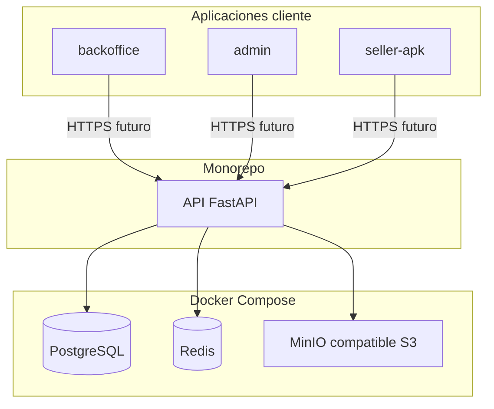
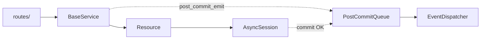
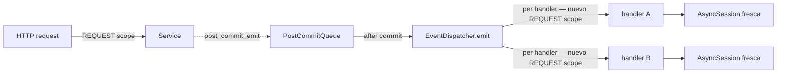

# Arquitectura actual (scaffold)

Visión de alto nivel del monorepo **Broker B2B** en su estado actual: aplicaciones, tecnologías y cómo se enlazan. No incluye dominio de negocio ni despliegue en producción.

## Monorepo

Un solo repositorio agrupa **tres aplicaciones de cliente** (Node/pnpm), **un servicio API** (Python/uv) y **definición de infraestructura local** (Docker Compose). El contrato entre clientes y backend será **HTTP** hacia la API REST (OpenAPI en `/docs` del servicio).

## Aplicaciones

| Pieza | Carpeta | Rol |
|--------|---------|-----|
| Portal proveedores | `apps/backoffice` | SPA para empresas que publican catálogo (nombre de carpeta acordado en el proyecto; en el PRD es "portal para proveedores"). |
| Administración | `apps/admin` | SPA para operación global (equivalente al "backoffice administrativo" del PRD). |
| Vendedores | `apps/seller-apk` | Misma base web que las anteriores; además **Capacitor** empaqueta el build estático para **Android** (APK/AAB vía proyecto `android/`). |
| API | `services/api` | **FastAPI**: punto único de verdad para datos y reglas cuando se implementen; hoy es scaffold con salud básica y OpenAPI. |

Todas las SPAs comparten enfoque: **Vite**, **React**, **TypeScript**, **TanStack Query**, **TanStack Router**, **Zustand** y **Tailwind CSS v4**.

## Tecnologías clave

- **Frontends:** pnpm workspaces, Vite, React 19, TanStack (query + router), Zustand, Tailwind.
- **Móvil:** Capacitor 8 sobre el artefacto web (`dist`).
- **Backend:** Python 3.12+, [uv](https://docs.astral.sh/uv/) (dependencias y entorno), FastAPI, Uvicorn, Pydantic / pydantic-settings, SQLModel, Alembic; **Dishka** como contenedor DI; cliente **Redis** async; **boto3** para S3; **arq** para background tasks.
- **Datos y servicios locales (Docker):** PostgreSQL, Redis, MinIO (API compatible S3 para desarrollo; en producción puede sustituirse por **AWS S3** con la misma idea de cliente).

## Relaciones

- Los **tres clientes** consumirán la **misma API** (URLs y auth pendientes de definir).
- La **API** persistirá en **PostgreSQL** (vía SQLModel + migraciones Alembic cuando existan modelos), usará **Redis** para caché/colas en evolución, y **objetos en almacenamiento tipo S3** (MinIO local o bucket AWS).
- **Docker Compose** no ejecuta la API ni los frontends; solo **Postgres, Redis y MinIO** para desarrollo local.

## Diagrama de componentes



En este diagrama, **seller-apk** es a la vez cliente web (Vite) y contenedor nativo Android cuando se sincroniza con Capacitor; la relación lógica con el backend es la misma que las otras SPAs.

## Capas de la API

Cada módulo de dominio (`app/modules/<dominio>/`) sigue esta estructura:

```
modules/<dominio>/
  models/           ← SQLModel(table=True)
  repositories/     ← hereda de Resource[T]  (app/lib/resource.py)
  services/         ← hereda de BaseService[T]  (app/lib/base_service.py)
  events.py         ← hereda de EntityEvent[T]  (app/lib/event_base.py)
  listener.py       ← suscripciones al EventDispatcher
  provider.py       ← Dishka Provider (repos + service en REQUEST scope)
  routes/           ← un router por recurso; `__init__.py` agrupa con `include_router`
  module.py         ← AppModule: agrupa router, listeners, models y provider
```

### Clases base genéricas (`app/lib/`)

| Clase | Archivo | Qué resuelve |
|-------|---------|--------------|
| `Resource[T]` | `resource.py` | CRUD async sobre `AsyncSession`. Los repositorios heredan sin repetir código. |
| `BaseService[T]` | `base_service.py` | CRUD que delega al `Resource`, con hooks `on_create`, `on_update`, `on_delete`, `on_get`, `on_list`. |
| `EntityEvent[T]` | `event_base.py` | Evento con campo `entity: T` tipado. |
| `PostCommitQueue` | `post_commit.py` | Cola por scope; se drena solo tras `session.commit()` exitoso. |
| `AppProvider` | `providers.py` | Provider central de Dishka (ver §Inyección de dependencias). |
| `AppModule` | `app_module.py` | Contrato de módulo: router, listeners, models y provider. |



## Inyección de dependencias (Dishka)

La DI está centralizada en **[Dishka](https://dishka.readthedocs.io/)** con un único `AsyncContainer` que vive durante toda la vida de la aplicación.

### Scopes

| Scope | Qué vive ahí |
|-------|-------------|
| `APP` | `Settings`, `AsyncEngine`, `async_sessionmaker`, `Redis`, `EventDispatcher` |
| `REQUEST` | `AsyncSession`, `PostCommitQueue`, repos y services de cada módulo |

Un **REQUEST scope** se abre automáticamente para cada una de estas unidades de trabajo:
- HTTP request (vía `DishkaRoute` / middleware de Dishka)
- Invocación de un listener de evento (vía `wrap_injection` en `EventDispatcher.subscribe`)
- Job de arq (vía `setup_dishka` en `WorkerSettings`, ver §Background tasks)

### Cómo declarar dependencias

En rutas HTTP, usar `FromDishka[T]` con `route_class=DishkaRoute`:

```python
from dishka import FromDishka
from dishka.integrations.fastapi import DishkaRoute
from fastapi import APIRouter

router = APIRouter(route_class=DishkaRoute)

@router.post("/")
async def create_product(body: Product, service: FromDishka[ProductService]):
    return await service.create(body)
```

En listeners de eventos, usar `FromDishka[T]` en los parámetros del handler — la inyección la gestiona el `EventDispatcher` al suscribir el handler. Cada invocación abre un REQUEST scope independiente con su propia `AsyncSession`:

```python
from dishka import FromDishka
from sqlalchemy.ext.asyncio import AsyncSession

async def _on_product_created(
    event: ProductCreated,
    session: FromDishka[AsyncSession],
    repo: FromDishka[ProductRepository],
) -> None:
    ...

def register_listeners(dispatcher: EventDispatcher) -> None:
    dispatcher.subscribe(ProductCreated, _on_product_created)
```

Para exponer un nuevo servicio o repo al contenedor, agregar un `@provide` en el `Provider` del módulo (`modules/<dominio>/provider.py`).

### Eventos de dominio (post-commit)

Los eventos se ejecutan **solo después de un commit exitoso**. El servicio llama `self.post_commit_emit(event)` dentro de un hook `on_*`; la cola se drena tras `session.commit()` en el scope del request original. Cada handler del evento recibe su propio REQUEST scope fresco (session nueva e independiente). Si un handler falla, se loguea pero no afecta a los demás handlers ni a la respuesta HTTP.



## Background tasks (arq)

Los jobs de arq usan exactamente el mismo contenedor y el mismo mecanismo de inyección. La integración oficial de Dishka para arq gestiona el REQUEST scope por job:

```python
from dishka.integrations.arq import FromDishka, inject, setup_dishka
from sqlalchemy.ext.asyncio import AsyncSession

@inject
async def reindex_products(
    ctx: dict,
    session: FromDishka[AsyncSession],
    repo: FromDishka[ProductRepository],
) -> None:
    ...

class WorkerSettings:
    functions = [reindex_products]
    redis_settings = ...

# Al arrancar el worker:
setup_dishka(container=container, worker_settings=WorkerSettings)
```

El `container` es el mismo `AsyncContainer` que usa la API. Se puede crear de forma independiente (proceso worker separado) importando `AppProvider` y los providers de módulos:

```python
from dishka import make_async_container
from app.lib.providers import AppProvider
from app.modules.products.provider import ProductsProvider

container = make_async_container(AppProvider(), ProductsProvider())
```

## Referencias

- Producto y roadmap: [PRD B2B](prd_broker_b2b.md).
- Comandos y variables de entorno: [README de la raíz](../README.md).
