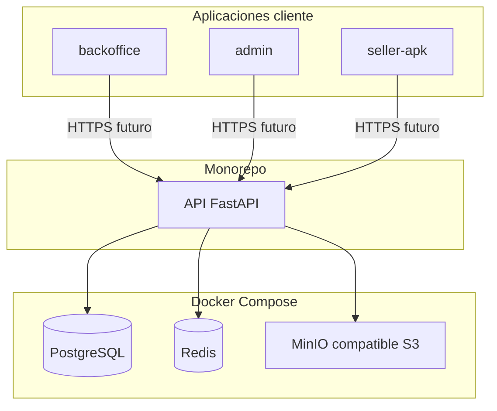

# Arquitectura actual (scaffold)

Visión de alto nivel del monorepo **Broker B2B** en su estado actual: aplicaciones, tecnologías y cómo se enlazan. No incluye dominio de negocio ni despliegue en producción.

## Monorepo

Un solo repositorio agrupa **tres aplicaciones de cliente** (Node/pnpm), **un servicio API** (Python/uv) y **definición de infraestructura local** (Docker Compose). El contrato entre clientes y backend será **HTTP** hacia la API REST (OpenAPI en `/docs` del servicio).

## Aplicaciones

| Pieza | Carpeta | Rol |
|--------|---------|-----|
| Portal proveedores | `apps/backoffice` | SPA para empresas que publican catálogo (nombre de carpeta acordado en el proyecto; en el PRD es “portal para proveedores”). |
| Administración | `apps/admin` | SPA para operación global (equivalente al “backoffice administrativo” del PRD). |
| Vendedores | `apps/seller-apk` | Misma base web que las anteriores; además **Capacitor** empaqueta el build estático para **Android** (APK/AAB vía proyecto `android/`). |
| API | `services/api` | **FastAPI**: punto único de verdad para datos y reglas cuando se implementen; hoy es scaffold con salud básica y OpenAPI. |

Todas las SPAs comparten enfoque: **Vite**, **React**, **TypeScript**, **TanStack Query**, **TanStack Router**, **Zustand** y **Tailwind CSS v4**.

## Tecnologías clave

- **Frontends:** pnpm workspaces, Vite, React 19, TanStack (query + router), Zustand, Tailwind.
- **Móvil:** Capacitor 8 sobre el artefacto web (`dist`).
- **Backend:** Python 3.12+, [uv](https://docs.astral.sh/uv/) (dependencias y entorno), FastAPI, Uvicorn, Pydantic / pydantic-settings, SQLModel, Alembic; cliente **Redis** async; **boto3** para S3; dependencias declaradas alineadas al PRD (**arq**, etc.) sin colas activas aún.
- **Datos y servicios locales (Docker):** PostgreSQL, Redis, MinIO (API compatible S3 para desarrollo; en producción puede sustituirse por **AWS S3** con la misma idea de cliente).

## Relaciones

- Los **tres clientes** consumirán la **misma API** (URLs y auth pendientes de definir).
- La **API** persistirá en **PostgreSQL** (vía SQLModel + migraciones Alembic cuando existan modelos), usará **Redis** para caché/colas en evolución, y **objetos en almacenamiento tipo S3** (MinIO local o bucket AWS).
- **Docker Compose** no ejecuta la API ni los frontends; solo **Postgres, Redis y MinIO** para desarrollo local.

## Diagrama de componentes

En este diagrama, **seller-apk** es a la vez cliente web (Vite) y contenedor nativo Android cuando se sincroniza con Capacitor; la relación lógica con el backend es la misma que las otras SPAs.

## Referencias

- Producto y roadmap: [PRD B2B](prd_broker_b2b.md).
- Comandos y variables de entorno: [README de la raíz](../README.md).
