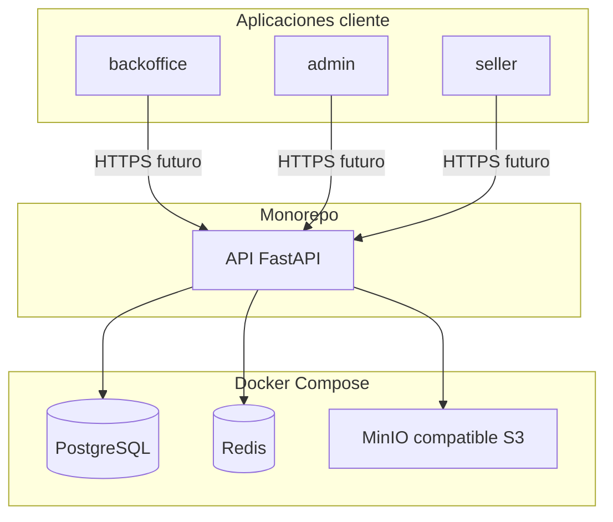

# Arquitectura actual (scaffold)

Visión de alto nivel del monorepo **Broker B2B** en su estado actual: aplicaciones, tecnologías y cómo se enlazan. No incluye dominio de negocio ni despliegue en producción.

> **Nota:** el servicio API está en fase de reimplementación (scaffold mínimo). La arquitectura interna del backend se documentará cuando se estabilice.

## Monorepo

Un solo repositorio agrupa **tres aplicaciones de cliente** (Node/pnpm), **un servicio API** (Python/uv) y **definición de infraestructura local** (Docker Compose). El contrato entre clientes y backend será **HTTP** hacia la API REST (OpenAPI en `/docs` del servicio).

## Aplicaciones

| Pieza | Carpeta | Rol |
|--------|---------|-----|
| Portal proveedores | `apps/backoffice` | SPA para empresas que publican catálogo (nombre de carpeta acordado en el proyecto; en el PRD es "portal para proveedores"). |
| Administración | `apps/admin` | SPA para operación global (equivalente al "backoffice administrativo" del PRD). |
| Vendedores | `apps/seller` | SPA para vendedores (misma arquitectura que backoffice: `@broker/api`, `@broker/ui`, React Router). |
| API | `services/api` | **FastAPI**: punto único de verdad para datos y reglas cuando se implementen; hoy es scaffold con salud básica, demo y OpenAPI. |

Todas las SPAs comparten enfoque: **Vite**, **React**, **TypeScript**, **TanStack Query**, **React Router**, **Zustand**, **Tailwind CSS v4**, y paquetes compartidos **`@broker/api`** (cliente Orval + auth) y **`@broker/ui`** (layout, CRUD, shadcn).

## Tecnologías clave

- **Frontends:** pnpm workspaces, Vite, React 19, TanStack Query, React Router, Zustand, Tailwind, `@broker/api`, `@broker/ui`.
- **Backend:** Python 3.12+, [uv](https://docs.astral.sh/uv/) (dependencias y entorno), FastAPI, Uvicorn.
- **Datos y servicios locales (Docker):** PostgreSQL, Redis, MinIO (API compatible S3 para desarrollo; en producción puede sustituirse por **AWS S3** con la misma idea de cliente).

## Relaciones

- Los **tres clientes** consumirán la **misma API** (URLs y auth pendientes de definir).
- La **API** usará **PostgreSQL**, **Redis** y **almacenamiento tipo S3** (MinIO local o bucket AWS) cuando se reintroduzcan en el nuevo diseño.
- **Docker Compose** no ejecuta la API ni los frontends; solo **Postgres, Redis y MinIO** para desarrollo local.

## Diagrama de componentes

```mermaid
flowchart TB
  subgraph clients [Aplicaciones cliente]
    BO[backoffice]
    AD[admin]
    SE[seller]
  end

  subgraph monorepo [Monorepo]
    API[API FastAPI]
  end

  subgraph docker [Docker Compose]
    PG[(PostgreSQL)]
    RD[(Redis)]
    S3[MinIO compatible S3]
  end

  BO -->|HTTPS futuro| API
  AD -->|HTTPS futuro| API
  SE -->|HTTPS futuro| API

  API --> PG
  API --> RD
  API --> S3
```

## Referencias

- Producto y roadmap: [PRD B2B](prd_broker_b2b.md).
- Comandos y variables de entorno: [README de la raíz](../README.md).
