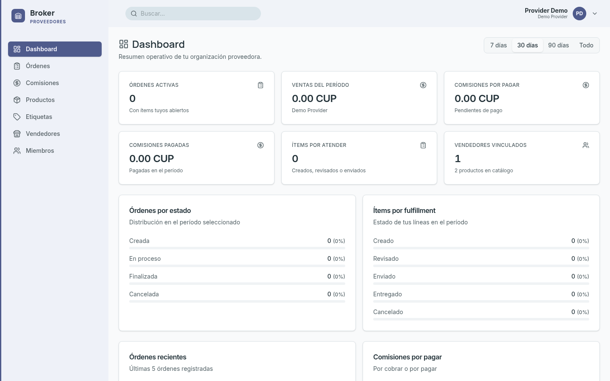
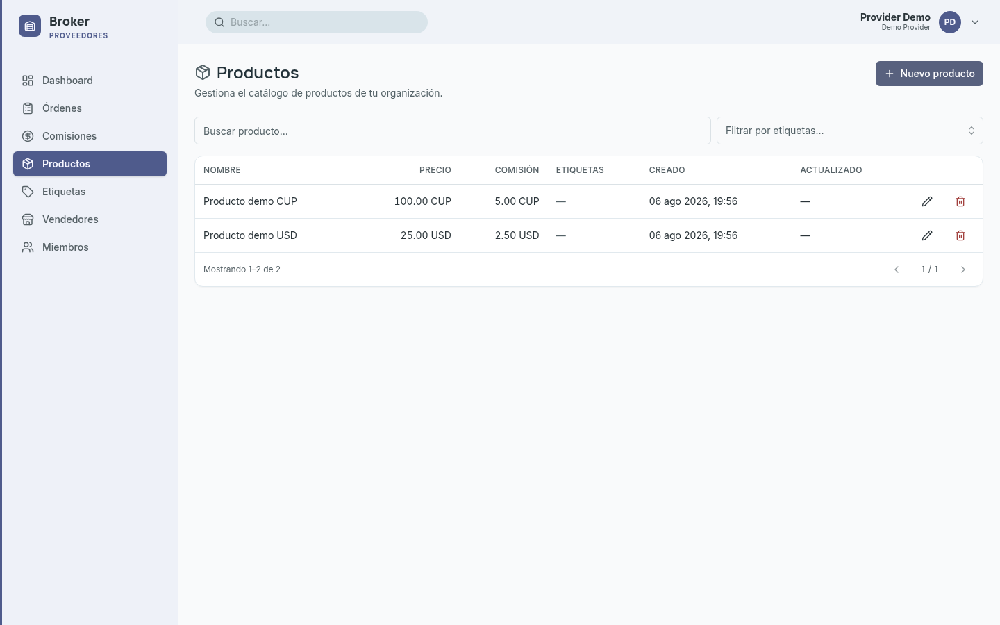
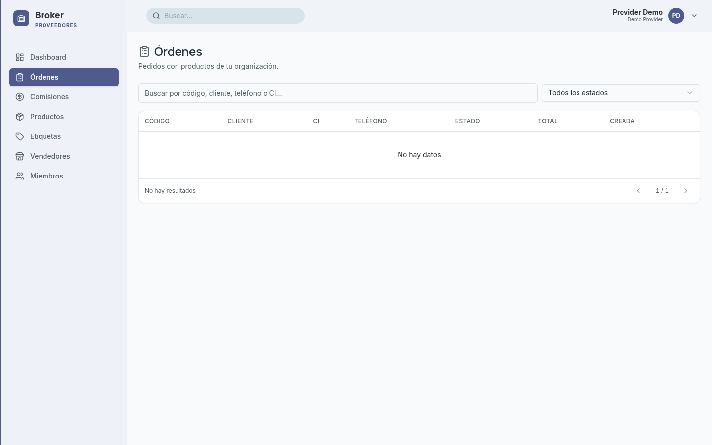
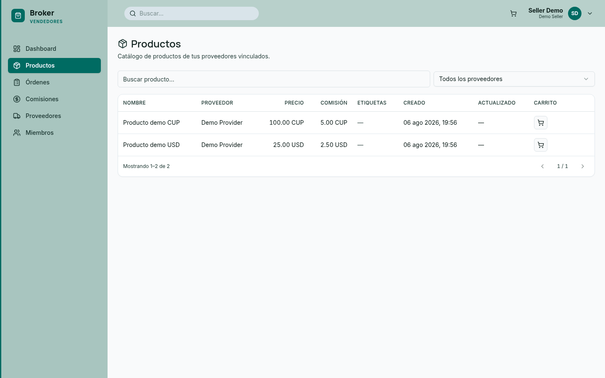
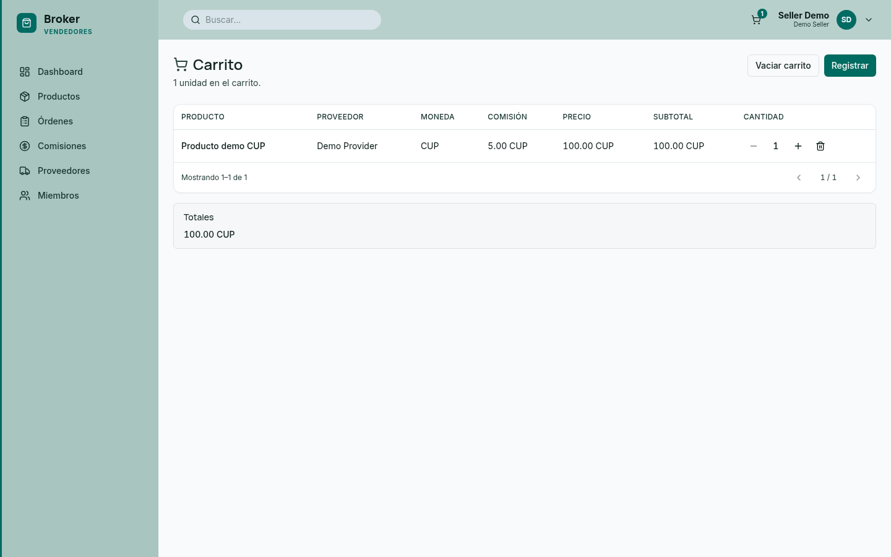

# Broker — Contenido landing de prelanzamiento

Documento de copy y assets para montar la página de prelanzamiento.  
**Público:** proveedores.  
**CTA:** formulario de registro (p. ej. Google Forms).

---

## 1. Hero

**Broker**

Conecta tu catálogo con tus vendedores. Sin fricción.

**CTA:** Quiero registrarme

---

## 2. El problema

- Catálogos y precios desactualizados entre tu equipo y tus vendedores.
- Pedidos por chat, Excel o WhatsApp: lentos y con errores.
- Cuesta coordinar stock y disponibilidad con quien te vende.

---

## 3. Qué es

Broker es una plataforma B2B que conecta proveedores con vendedores: un solo lugar para catálogo, pedidos y relación comercial.

---

## 4. Para proveedores

- Publica y gestiona tu catálogo (precios, stock, disponibilidad).
- Recibe pedidos de tus vendedores de forma ordenada.
- Comparte Broker con tus vendedores: ellos piden sobre tu catálogo.
- Integra con tus sistemas cuando lo necesites (API).

---

## 5. Cómo funciona

1. **Publicas** tu catálogo en Broker.
2. **Compartes** la app con tus vendedores.
3. **Recibes** pedidos y creces con ellos.

Los vendedores llegan de forma orgánica: tú los traes.

---

## 6. Vista previa del producto

### Portal del proveedor

*Tu panel: actividad, pedidos y visión general.*

*Gestiona productos, precios y disponibilidad.*

*Pedidos de tus vendedores, en un solo lugar.*

### Lo que ven tus vendedores

*Tus vendedores exploran tu catálogo y piden.*

*Arman el pedido y te lo envían.*

---

## 7. Por qué ahora

Estamos en prelanzamiento.  
Registrarte como proveedor te da acceso anticipado.  
Cuando tú estés dentro, tus vendedores te siguen.

---

## 8. Modelos

Trabajamos con modelos flexibles: comisión por venta u otras opciones según contratación.

---

## 9. CTA final

Únete al prelanzamiento.

**CTA:** Quiero registrarme  
*(Enlace al formulario de registro / Google Forms.)*

---

## 10. Notas para implementar la página

- Secciones en este orden: Hero → Problema → Qué es → Para proveedores → Cómo funciona → Capturas → Por qué ahora → Modelos → CTA.
- Formulario: Google Forms (o similar) con campos mínimos: nombre, empresa, email, teléfono (opcional).
- Poco texto en pantalla; usar los bullets tal cual.
- Imágenes en `docs/landing/screenshots/` (desktop ~1440px).
- Marca provisional: **Broker** (cambiar cuando haya nombre definitivo).
- No hacer landing para vendedores en esta fase: el mensaje es “tú traes a tus vendedores”.

> Nota: la página ya está implementada en `renierricardo.dev/src/pages/proyectos/broker.astro`.

---

# Contexto de marketing (para anuncios en redes y otros canales)

Material de referencia para crear anuncios, posts y campañas. No es copy final: es el contexto que cualquier pieza debe respetar.

## 11. Cómo funciona el negocio hoy (el mundo real)

Este es el flujo manual que Broker automatiza. Todos los anuncios deben partir de esta realidad, porque el público objetivo se reconoce en ella:

1. Los **proveedores** publican su mercancía (fotos, precios) en **grupos de WhatsApp**.
2. En esos grupos están los **gestores de venta**, que toman los productos y los promocionan donde quieran: redes sociales, sitios web, otros canales.
3. Cuando un posible cliente contacta al gestor, empieza el proceso de venta. Si se cierra, el gestor toma los **datos del comprador** a mano.
4. El gestor envía esos datos al proveedor **por chat**.
5. El proveedor **entrega el producto y cobra** en la entrega.
6. Al final del día, el proveedor **paga las comisiones** a cada gestor, cuadrando ventas en libretas o Excel.

**Dolores concretos** (usar en hooks de anuncios):

- Precios y fotos desactualizados, reenviados grupo por grupo.
- Datos del comprador con errores (dictados, copiados a mano).
- Ventas sin registro: libreta, Excel y memoria.
- Horas cuadrando comisiones al final del día; discusiones con gestores.
- “¿Te queda alguno?”: el stock se consulta por chat, nadie lo sabe en tiempo real.

## 12. Actores y qué gana cada uno

| Actor | Quién es | Qué gana con Broker |
|---|---|---|
| **Proveedor** | El que vende los productos | Registro automático de cada venta, comisiones exactas por gestor, catálogo siempre al día, API/webhooks para su sistema |
| **Gestor de venta** | Promociona y cierra ventas con compradores | Publica donde quiera, stock en tiempo real, registra la venta en segundos, cobra su comisión sin reclamos |
| **Comprador** | Cliente final | Sus datos viajan sin errores; recibe y paga en la entrega, como siempre |

**Estrategia de captación:** el público de los anuncios son los **proveedores**. Los gestores llegan de forma orgánica: cada proveedor comparte Broker con sus gestores. No hacer campañas dirigidas a gestores ni a compradores en esta fase.

## 13. Propuesta de valor (mensajes centrales)

- **Mensaje madre:** “Del grupo de WhatsApp a un negocio automatizado.”
- El negocio no cambia: publicas, tus gestores venden, tú entregas y cobras. Broker elimina la parte que duele: el registro, las comisiones y el catálogo desactualizado.
- Frase de cierre recurrente: **“Deja la libreta. Quédate con el negocio.”**
- Diferenciales técnicos (para audiencias más avanzadas):
  - **API**: conecta tu ERP/inventario y actualiza productos automáticamente.
  - **Webhooks**: tu sistema recibe una notificación con cada venta.
  - Los gestores pueden montar **sus propios sitios web usando Broker como backend**, con stock en tiempo real.
  - **Herramientas de difusión**: publicar productos en redes sociales en un clic.

## 14. Ángulos de anuncio (ideas de campañas)

1. **El dolor de la libreta** — “¿Sigues cuadrando comisiones a mano al final del día?” → Broker las calcula solas.
2. **El caos del grupo** — “Tu catálogo vive en 14 grupos de WhatsApp, y en cada uno tiene un precio distinto.” → Un catálogo vivo, siempre actualizado.
3. **Datos con errores** — “Nombre, dirección, teléfono… dictados por voz y copiados a mano.” → Los datos del comprador viajan en la orden.
4. **Crecer sin miedo** — “Más gestores = más ventas, pero también más errores y más horas cuadrando.” → Con Broker crecer no duele.
5. **Tiempo real** — “Se te acabó el producto y tus gestores lo siguen vendiendo.” → Stock en tiempo real para todos.
6. **Para técnicos** — “Conecta tu inventario por API y olvídate de actualizar a mano.” → webhook en cada venta.

## 15. Tono y estilo

- **Idioma:** español, tuteo directo (“tú publicas”, “tus gestores”).
- **Tono:** cercano y concreto, de comerciante a comerciante. Nada corporativo ni abstracto.
- **Regla de oro:** poco texto, frases cortas, que se reconozcan en la escena (WhatsApp, libreta, entrega, comisión).
- Hablar de “gestores de venta” (así los llama el público), no de “sellers” ni “distribuidores”.
- Evitar jerga técnica salvo en el ángulo para técnicos (API, webhooks).

## 16. Datos prácticos

- **Marca:** Broker (provisional, puede cambiar).
- **Estado:** prelanzamiento; el producto ya funciona (hay capturas reales).
- **CTA estándar:** “Quiero registrarme” → WhatsApp +53 53024637 (o formulario de registro).
- **Email de contacto:** aprezcuba24@gmail.com
- **Landing:** `renierricardo.dev/proyectos/broker`
- **Monetización:** flexible; comisión por venta u otros modelos según contratación. No prometer precios en anuncios.
- **Oferta de prelanzamiento:** acceso anticipado + participar en la definición del producto.

## 17. Assets disponibles

- Capturas reales del producto en `docs/landing/screenshots/` (y en `renierricardo.dev/public/proyectos/broker/`):
  - `01-backoffice-dashboard.png` — panel del proveedor (KPIs, ventas, comisiones).
  - `02-backoffice-products.png` — catálogo con precio y comisión por producto.
  - `03-backoffice-orders.png` — órdenes registradas del proveedor.
  - `04-seller-products.png` — catálogo que ve el gestor, con su comisión clara.
  - `05-seller-cart.png` — el gestor arma la orden con los datos del comprador.
- Paleta de la landing: fondo oscuro (#07090F), esmeralda para “con Broker”, ámbar para “el problema hoy”, cian para gestores.
- Tipografías de la landing: Bricolage Grotesque (títulos) + Instrument Sans (texto).
